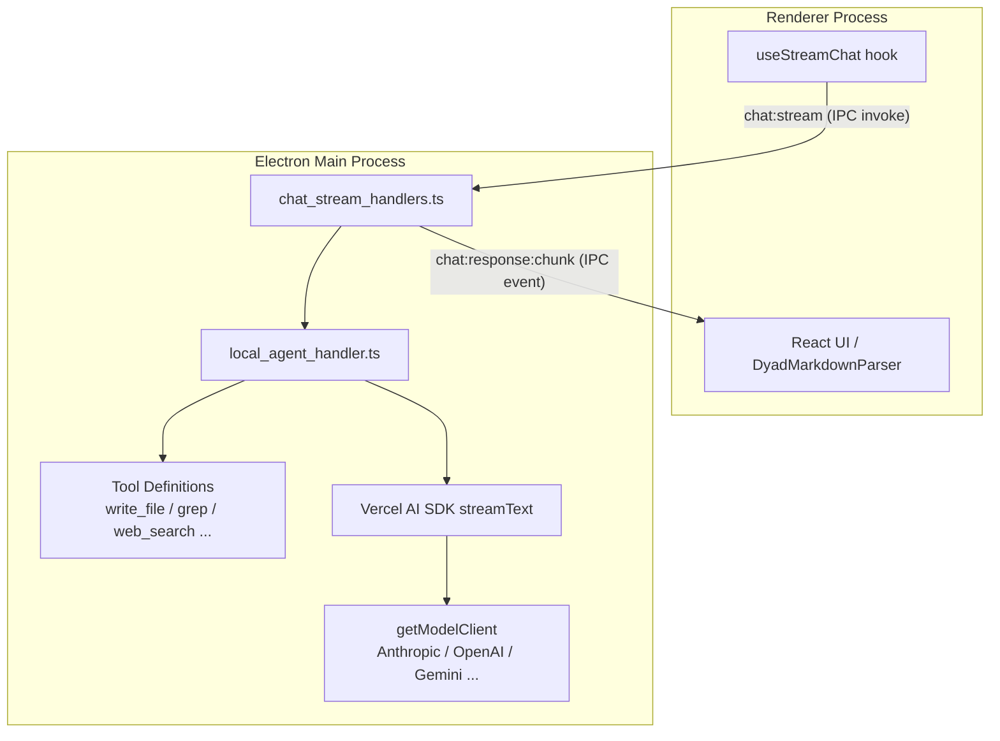
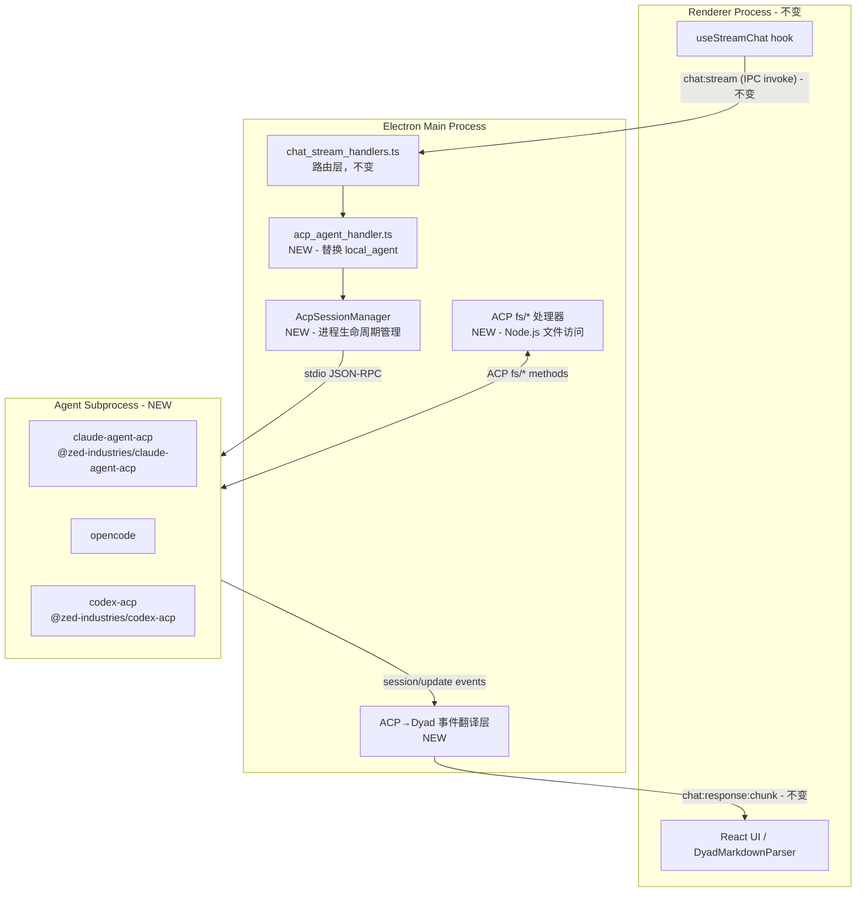

# Dyad × ACP 集成可行性评估

## 结论：**可行，但工程量较大**

技术上完全可行，ACP 的架构与 Dyad 的 Electron IPC 边界高度契合。核心挑战是 **ACP 流事件 → Dyad `<dyad-*>` XML 渲染层** 的翻译。

---

## 当前架构概览




## 目标架构（ACP 替换）




---

## 前端层：**完全不需要改动**

以下代码可以原封不动保留：

- `[src/components/chat/](src/components/chat/)` — ChatPanel, MessagesList, DyadMarkdownParser, ChatInput 等所有 29 个 `<dyad-*>` 组件
- `[src/hooks/useStreamChat.ts](src/hooks/useStreamChat.ts)`、`[useChats.ts](src/hooks/useChats.ts)` 等全部 React hooks
- `[src/ipc/types/chat.ts](src/ipc/types/chat.ts)` — IPC 合约和类型
- `[src/atoms/chatAtoms.ts](src/atoms/chatAtoms.ts)` — Jotai 原子
- `[src/ipc/handlers/chat_stream_handlers.ts](src/ipc/handlers/chat_stream_handlers.ts)` — IPC 路由层（只需新增一个 mode 分支）
- SQLite/Drizzle 消息存储层

---

## ACP 协议与 Dyad 概念映射


| ACP 概念                                                 | Dyad 对应                                          | 翻译难度 |
| ------------------------------------------------------ | ------------------------------------------------ | ---- |
| `session/prompt`                                       | `chat:stream` IPC invoke                         | 低    |
| `session/update` → `agent_message_chunk`               | `chat:response:chunk` 文本增量                       | 低    |
| `session/update` → `tool_call` (kind: read)            | `<dyad-read>` / `<dyad-grep>` XML tag            | 中    |
| `session/update` → `tool_call` (kind: edit, with diff) | `<dyad-search-replace>` / `<dyad-write>` XML tag | 中    |
| `session/update` → `plan` entries                      | `agent-tool:todos-update` IPC event              | 中    |
| `session/request_permission`                           | `agent-tool:consent-request`                     | 低    |
| `session/cancel`                                       | `chat:cancel`                                    | 低    |
| ACP `fs/read`, `fs/write` handlers                     | Node.js `fs` 直接调用                                | 低    |
| ACP session 长连接                                        | 每条消息重建 context（目前）→ 需会话持久化                       | 高    |


---

## 各 Agent Runtime 支持情况


| Agent              | ACP 支持  | npm 包                              | 备注         |
| ------------------ | ------- | ---------------------------------- | ---------- |
| **Claude Code**    | ✅ 官方适配器 | `@zed-industries/claude-agent-acp` | 功能最完整      |
| **Codex CLI**      | ✅ 官方适配器 | `@zed-industries/codex-acp`        | Zed 维护     |
| **OpenCode**       | ✅ 原生支持  | `opencode` CLI                     | SST 出品     |
| **GitHub Copilot** | ✅ 公测中   | `gh copilot`                       | 2026.01 开放 |
| **Gemini CLI**     | ✅       | `gemini` CLI                       | Google 官方  |
| **Cline**          | ✅       | `cline`                            | 社区活跃       |


---

## 技术实现要点

### 1. ACP 进程管理（`AcpSessionManager`）

- 在 Electron main process 中 `child_process.spawn()` 启动 agent 子进程
- 管理 stdin/stdout 的换行符分隔 JSON-RPC 消息流
- 每个 Dyad chat 对应一个 ACP session（`session/new`）
- 跨消息复用 session（持久化 sessionId）

### 2. 翻译层核心逻辑

```typescript
// ACP tool_call update → <dyad-*> XML tag 生成
function acpToolCallToDyadXml(update: AcpToolCallUpdate): string {
  switch (update.kind) {
    case "edit": return buildDyadEditXml(update);
    case "read": return buildDyadReadXml(update);
    case "search": return buildDyadGrepXml(update);
    // ...
  }
}
```

ACP 的 `diff` content type 可以直接映射到 `<dyad-search-replace>` 标签。

### 3. 文件系统桥接

ACP 的 `fs/*` 方法（`fs/read`, `fs/write`, `fs/list`, `fs/exists`）需要在 main process 中实现，将请求转为 Node.js `fs` 调用，并将结果返回给 agent 子进程。

### 4. 新增 chat mode：`acp-agent`

在 `chat_stream_handlers.ts` 中新增分支：

```typescript
case "acp-agent":
  return handleAcpAgentStream(params, event, settings);
```

保留现有 `build`/`local-agent`/`ask`/`plan` 模式不变，ACP 作为新选项。

### 5. Settings UI

新增 agent 选择器：选择 agent 类型（Claude Code / OpenCode / Codex）和对应的配置（API key、可执行文件路径等）。

---

## 风险与限制

**会丢失的 Dyad 功能（高风险）：**

- **Dyad Pro Engine** (`engine.dyad.sh`) — 智能上下文、懒编辑、集成 web 搜索等 Pro 功能依赖内置 LLM 路由，外部 agent 无法使用
- **Token 计数** — 外部 agent 自行管理 token，Dyad 无法精确统计
- `**build` 模式** — 单轮 `<dyad-write>` 标签流不适合 ACP；需保留独立代码路径
- **代码库上下文注入** (`extractCodebase`) — 外部 agent 有自己的 context 策略，可能重复或冲突

**中等风险：**

- **ACP 能力差异** — 不同 agent 支持的 ACP 功能集不同（有些不支持 `diff`、`terminal`、`plan` 等）
- **Git 自动提交冲突** — Claude Code 等 agent 可能自己做 git 操作，与 Dyad 的 `commitAllChanges()` 冲突
- **Session 持久化** — Electron 重启后需要恢复或重建 ACP session
- **Supabase/MCP 集成** — 目前 Dyad 内置的 Supabase 工具需要单独处理

**低风险：**

- stdio 通信在 Electron main process 中稳定可用
- ACP TypeScript SDK 成熟（Zed 生产使用）

---

## 推荐实施路径（分阶段）

### Phase 1（2-3 周）：MVP 验证

- 实现 `AcpSessionManager` 基础进程管理
- 接入单个 agent（`claude-agent-acp`）
- 完成文本流翻译：ACP `agent_message_chunk` → `chat:response:chunk`
- 基本的 session/cancel 支持
- 验证前端不需要任何改动

### Phase 2（3-4 周）：工具可视化

- 实现完整的 ACP tool_call → `<dyad-*>` XML 翻译层
- ACP `fs/`* 文件系统桥接
- `session/request_permission` → Dyad 同意对话框
- Plan/todo 同步

### Phase 3（2-3 周）：多 agent 支持与 UX

- 接入 OpenCode、Codex CLI 等其他 agent
- Settings 页面中的 agent 选择器 UI
- ACP session 持久化（跨 Electron 重启）
- 错误处理和 agent 崩溃恢复

---

## 总结


| 维度        | 评估                                                  |
| --------- | --------------------------------------------------- |
| **技术可行性** | 高 — ACP stdio + Electron subprocess 天然契合            |
| **前端改动量** | 极小 — 全部 React/IPC 层保持不变                             |
| **后端改动量** | 中等 — 替换 `local_agent_handler.ts`，新增 ~1000-2000 行翻译层 |
| **总工程量**  | 约 7-10 周完整实现（Phase 1 MVP 约 2-3 周）                   |
| **最大风险**  | Dyad Pro 功能丢失；ACP agent 能力集不统一                      |
| **生态活跃度** | 极高 — 30+ agent 支持 ACP，Zed/JetBrains 均采用             |


